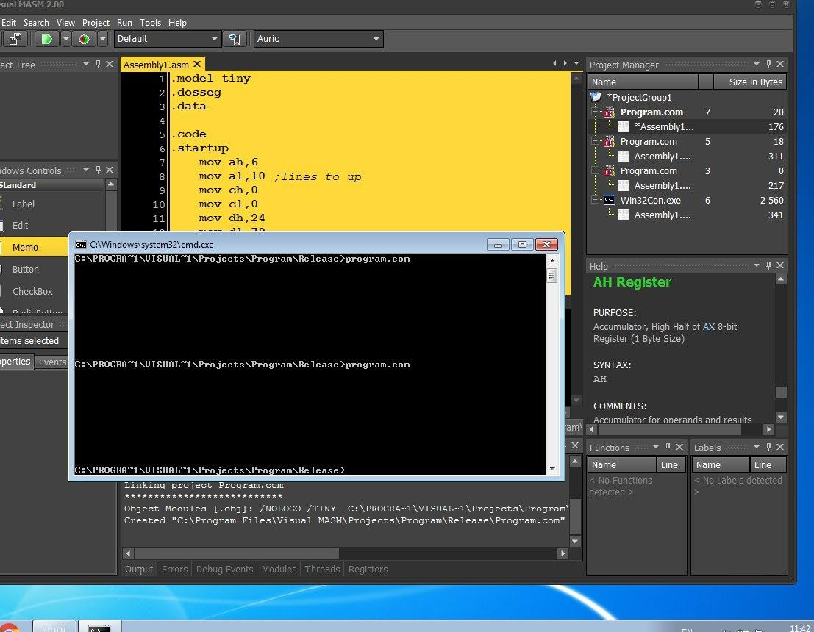
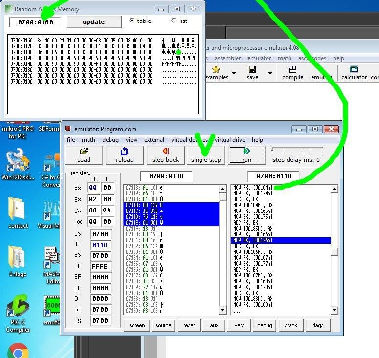
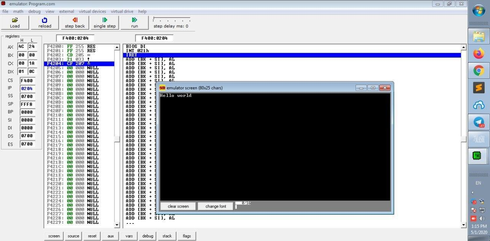

# Assembly 8086-8088

Assembly Project compatible with 8086/8088 microprocessor.

For each program use Microsoft assembler (MASM 6.14)

The instructions should be compatible with 8086/8088 microprocessor.

# Program 1

Write a program that adds 8 words of data..


# Program 2

Write a program that copies the 500 most recent values from the PC real clock into the memory array CLKDATA.

# Program 3

Write a program that copies element 1 of record A into element 3 of record D by using the relative -plus index mode of addressing. The file should contain 4 records 20 elements each. Define file and record A as the same memory location.

# Program 4

Write a program that scrolls the video display up 2 lines and clears the bottom 2 lines

# Program 5

Write a program that uses the XLAT assembly command to convert from BCD to Gray code.

# Program 6

Use the CMPS command to write a program that tests the video display for the word MANUN. If MANUN appears anywhere on the display a Y is displayed, if not a N is displayed.

# Program 7

Write a procedure to solve the quadratic equation `Y=5X^2-2X+6`, where the value of X is stored in AL and the result of the equation (Y) is returned in AX. To test this procedure, write a __software driver__ that will send each X-input value (from the table shown below) to the procedure one at a time and check for a month with the expected Y-output value each time. If all four tests pass, display the message "procedure passes", if any one test fails the error message "procedure fails" is output.

```
0 -> 6
1 -> 9
10 -> 486
100 -> 49806
```

-----

## Tools

- Visual Masm



https://visualmasm.com/

- Emulator





https://download.cnet.com/Emu8086-Microprocessor-Emulator/3000-2069_4-10392690.html

https://sites.google.com/site/vkeyboard111/2

- DosBox

https://www.dosbox.com/

Many thanks to ValK.

---------

# Max Base

My nickname is Max, Programming language developer, Full-stack programmer. I love computer scientists, researchers, and compilers. ([Max Base](https://maxbase.org/))

## Asrez Team

A team includes some programmer, developer, designer, researcher(s) especially Max Base.

[Asrez Team](https://www.asrez.com/)
